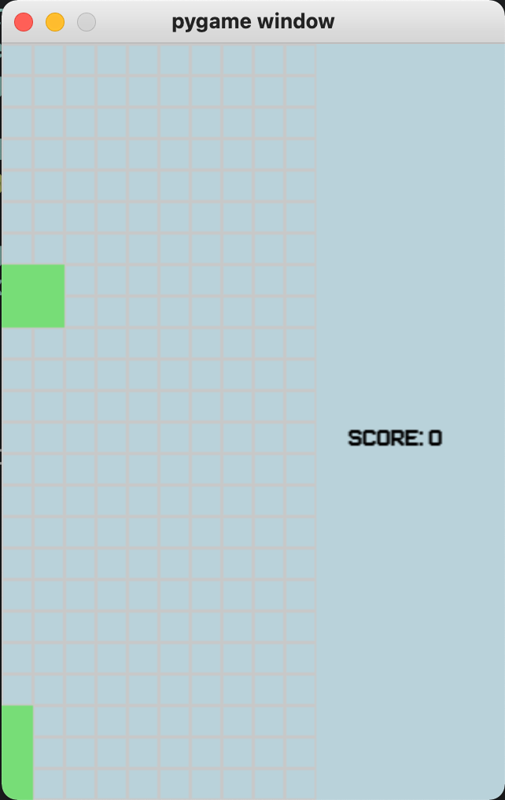

## Requirement
    - Python >= 3.9
    - Poetry 
---
## Installation
### Clone the project
```bash
git clone https://github.com/huytd2k/pytetris.git
cd pytetris
```
### Install dependencies
```bash
poetry install --no-dev
```
### Run with poetry
```bash
poetry run python pytetris/main.py
```
### Screnshoot
!
## TODOS
- [ ] Refractor the code, it's kinda sucks now
- [ ] Draw brick queue on scree
- [ ] UI


